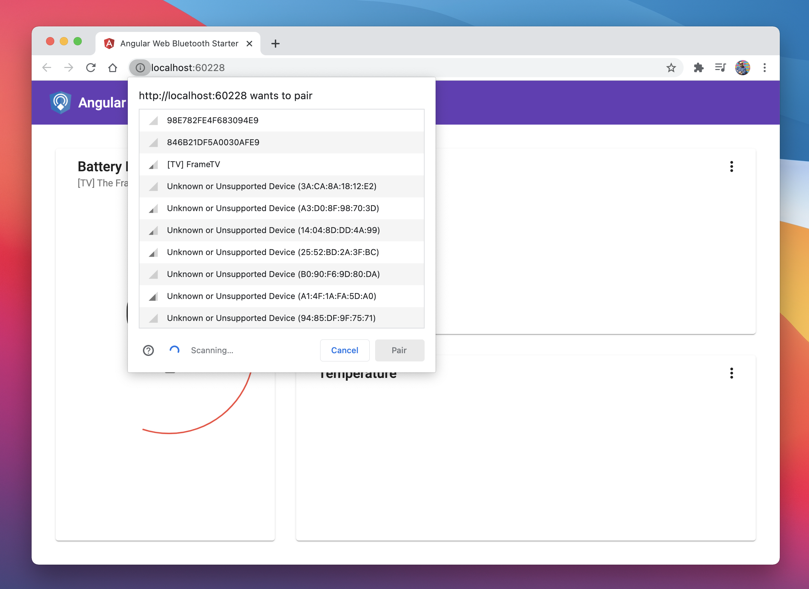

<div align="center">
  
</div>
<h2 align="center">The missing Web Bluetooth module for Angular</h2>
<p align="center"></p>

## Install

```
npm install -S @manekinekko/angular-web-bluetooth @types/web-bluetooth
```

> Note: Make also sure the `@types/web-bluetooth` is installed correctly in your `node_modules`.

## Getting started

## 1) import the `WebBluetoothModule` module

```typescript
import { NgModule } from '@angular/core';
import { WebBluetoothModule } from '@manekinekko/angular-web-bluetooth';

@NgModule({
  imports: [
    //...,
    WebBluetoothModule.forRoot({
      enableTracing: true // or false, this will enable logs in the browser's console
    })
  ]
  //...
})
export class AppModule {}
```

## 2.a) use it in your service/component (the easiest way)

Here is an annotated example using the `BluetoothCore` service:

```javascript
import { Injectable } from '@angular/core';
import { BluetoothCore } from '@manekinekko/angular-web-bluetooth';
import { map } from 'rxjs/operators';

@Injectable({
  providedIn: 'root'
})
export class BatteryLevelService {

  constructor(public readonly ble: BluetoothCore) {}

  getDevice() {
    // call this method to get the connected device
    return this.ble.getDevice$();
  }

  stream() {
    // call this method to get a stream of values emitted by the device for a given characteristic
    return this.ble.streamValues$().pipe(
      map((value: DataView) => value.getInt8(0))
    );
  }

  disconnectDevice() {
    // call this method to disconnect from the device. This method will also stop clear all subscribed notifications
    this.ble.disconnectDevice();
  }

  value() {
    console.log('Getting Battery level...');

    return this.ble
      .value$({
        service: 'battery_service',
        characteristic: 'battery_level'
      });
  }

}
```


## 2.b) use it in your service/component (the advanced way)

Here is an annotated example using the `BluetoothCore` service:

```javascript
import { Injectable } from '@angular/core';
import { map, mergeMap } from 'rxjs/operators';
import { BluetoothCore } from '@manekinekko/angular-web-bluetooth';

@Injectable({
  providedIn: 'root'
})
export class BatteryLevelService {
  static GATT_CHARACTERISTIC_BATTERY_LEVEL = 'battery_level';
  static GATT_PRIMARY_SERVICE = 'battery_service';

  constructor(public ble: BluetoothCore) {}

  getDevice() {
    // call this method to get the connected device
    return this.ble.getDevice$();
  }

  stream() {
    // call this method to get a stream of values emitted by the device
    return this.ble.streamValues$().pipe(map((value: DataView) => value.getUint8(0)));
  }

  disconnectDevice() {
    this.ble.disconnectDevice();
  }

  /**
   * Get Battery Level GATT Characteristic value.
   * This logic is specific to this service, this is why we can't abstract it elsewhere.
   * The developer is free to provide any service, and characteristics they want.
   *
   * @return Emites the value of the requested service read from the device
   */
  value() {
    console.log('Getting Battery level...');

    return this.ble

        // 1) call the discover method will trigger the discovery process (by the browser)
        .discover$({
          acceptAllDevices: true,
          optionalServices: [BatteryLevelService.GATT_PRIMARY_SERVICE]
        })
        .pipe(

          // 2) get that service
          mergeMap((gatt: BluetoothRemoteGATTServer) => {
            return this.ble.getPrimaryService$(gatt, BatteryLevelService.GATT_PRIMARY_SERVICE);
          }),

          // 3) get a specific characteristic on that service
          mergeMap((primaryService: BluetoothRemoteGATTService) => {
            return this.ble.getCharacteristic$(primaryService, BatteryLevelService.GATT_CHARACTERISTIC_BATTERY_LEVEL);
          }),

          // 4) ask for the value of that characteristic (will return a DataView)
          mergeMap((characteristic: BluetoothRemoteGATTCharacteristic) => {
            return this.ble.readValue$(characteristic);
          }),

          // 5) on that DataView, get the right value
          map((value: DataView) => value.getUint8(0))
        )
  }
}
```

## API documentation

The API documentation can be found here:  https://manekinekko.github.io/angular-web-bluetooth/

## Need a starter?



This project serves also as a starter. Run the following command:

```bash
npm start
```

## Blog post

Checkout my full [blog post on dev.to](https://dev.to/angular/the-web-bluetooth-module-for-angular-314b) about how to use this package in your app.

## Have a PR?

All contributions are welcome. Here are few [open issues](https://github.com/manekinekko/angular-web-bluetooth/issues?q=is%3Aissue+is%3Aopen+label%3A%22help+wanted%22) that I need help with ;)

# License

The MIT License (MIT) Copyright (c) 2017 - Wassim CHEGHAM

Permission is hereby granted, free of charge, to any person obtaining a copy of this software and associated documentation files (the "Software"), to deal in the Software without restriction, including without limitation the rights to use, copy, modify, merge, publish, distribute, sublicense, and/or sell copies of the Software, and to permit persons to whom the Software is furnished to do so, subject to the following conditions:

The above copyright notice and this permission notice shall be included in all copies or substantial portions of the Software.

THE SOFTWARE IS PROVIDED "AS IS", WITHOUT WARRANTY OF ANY KIND, EXPRESS OR IMPLIED, INCLUDING BUT NOT LIMITED TO THE WARRANTIES OF MERCHANTABILITY, FITNESS FOR A PARTICULAR PURPOSE AND NONINFRINGEMENT. IN NO EVENT SHALL THE AUTHORS OR COPYRIGHT HOLDERS BE LIABLE FOR ANY CLAIM, DAMAGES OR OTHER LIABILITY, WHETHER IN AN ACTION OF CONTRACT, TORT OR OTHERWISE, ARISING FROM, OUT OF OR IN CONNECTION WITH THE SOFTWARE OR THE USE OR OTHER DEALINGS IN THE SOFTWARE.
